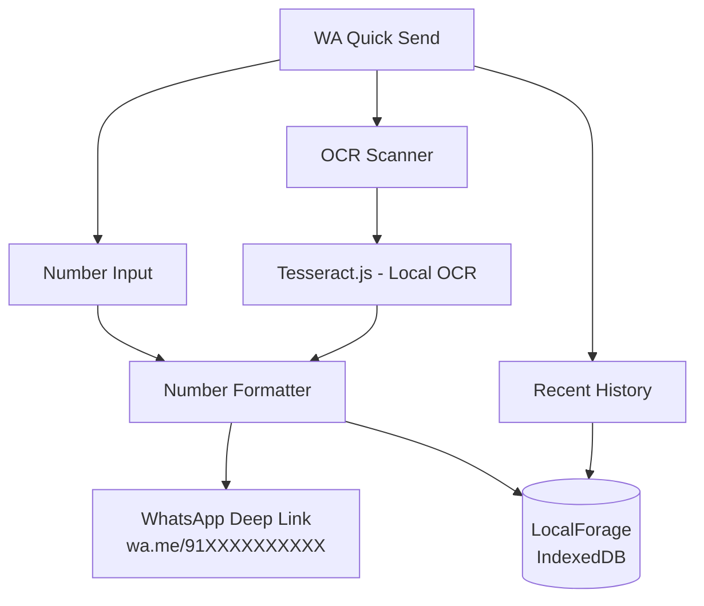

<div align="center">
  <h1>⚡ WA Quick Send</h1>
  <p><strong>Send WhatsApp messages to any number — instantly. No saving. No clutter.</strong></p>

  <p>
    <a href="#"><b>Live App</b></a> ·
    <a href="#-features">Features</a> ·
    <a href="#-tech-stack">Tech Stack</a> ·
    <a href="#-getting-started">Getting Started</a> ·
    <a href="#-roadmap">Roadmap</a>
  </p>

  
  
  
  
  
</div>

---

**WA Quick Send** is a lightweight, privacy-first Progressive Web App that eliminates the most common friction in WhatsApp messaging — the need to save a contact before you can message them.

Type a number, scan a business card, or tap a recent contact. One tap opens a WhatsApp chat, with your message pre-filled. No phonebook clutter. No account. No data leaving your device.

> WA Quick Send is a deep-link utility — not a messaging client or WhatsApp wrapper. All actual communication goes through the user's installed WhatsApp app.

---

## ✨ Features

### ⚡ Instant Click-to-Chat
- **Smart Number Input** — Accepts numbers in any format: with/without country code, spaces, or dashes
- **Auto-Formatting** — Automatically sanitizes input and applies a default country code if missing
- **Pre-filled Messaging** — Draft your message before opening WhatsApp so it lands pre-typed and ready to send

### 📷 OCR Number Scanning
- **Camera Integration** — Point your camera at a business card, flyer, or any physical surface
- **Image Upload** — Pick a screenshot or photo from your gallery
- **Smart Extraction** — Tesseract.js reads the image locally, identifies phone numbers, and auto-fills the input — all on-device, no server involved

### 🕒 Local Recent History
- **Recent Numbers List** — A fast, scrollable list of numbers you've messaged
- **One-Tap Reconnect** — Follow up with any number without re-scanning or re-entering
- **Fully Private** — History is stored in IndexedDB on your device and can be cleared anytime

### 📲 App-Like Experience (PWA)
- **Add to Home Screen** — Install directly without going through an app store
- **Full-Screen Mode** — Opens as a standalone app, not a browser tab
- **Offline Capable** — Works without internet after the first load

---

## 🏗️ Architecture



**How it works:**
- **Number Formatter:** Strips non-numeric characters, applies the default country code, and constructs a `https://wa.me/` deep link that WhatsApp's app protocol handles natively.
- **OCR Scanner:** Tesseract.js runs entirely in the browser via WebAssembly. Images are never uploaded anywhere — recognition happens locally on the device.
- **Local History:** `localforage` wraps IndexedDB with a simple async API. All recently used numbers are stored and retrieved from the device's own storage.

---

## 🛠️ Tech Stack

| Layer | Technology | Why |
|-------|-----------|-----|
| UI Framework | React 19 | Component-based, fast, wide ecosystem |
| Build Tool | Vite 8 | Instant dev server, optimized PWA builds |
| OCR | Tesseract.js 7 | 100% local, WebAssembly-powered text recognition |
| Storage | localforage (IndexedDB) | Async local history without cloud dependency |
| Icons | lucide-react | Clean, modern, tree-shakable icon set |
| Styling | Vanilla CSS | Full design control, zero overhead, premium animations |
| PWA | Web App Manifest + Service Worker | Installable and offline-capable |
| Deployment | GitHub Pages | Static delivery, zero infra |

---

## 📂 Project Structure

```text
whatsapp-quick-send/
├── public/
│   ├── favicon.svg
│   ├── icon-192.png
│   ├── icon-512.png
│   └── manifest.webmanifest
├── src/
│   ├── components/
│   │   ├── NumberInput/        ← Smart phone number input field
│   │   ├── Scanner/            ← Camera + image OCR flow
│   │   ├── RecentHistory/      ← Local history drawer
│   │   └── ui/                 ← Shared buttons, modals, loaders
│   ├── hooks/
│   │   ├── useHistory.js       ← localforage read/write
│   │   └── useOCR.js           ← Tesseract.js wrapper
│   ├── utils/
│   │   └── phoneFormatter.js   ← Number cleaning & deep link builder
│   ├── App.jsx
│   ├── main.jsx
│   └── index.css
├── index.html
├── vite.config.js
├── package.json
└── README.md                   ← this file
```

---

## 🚀 Getting Started

### Prerequisites
- Node.js v18+
- npm

### Setup

```bash
# Clone the repository
git clone https://github.com/sumitrawat2417/whatsapp-quick-send.git
cd whatsapp-quick-send

# Install dependencies
npm install

# Start development server
npm run dev
# → http://localhost:5173
```

### Build for Production

```bash
npm run build
npm run preview
```

---

## 🔮 Roadmap

| Feature | Status | Notes |
|---------|--------|-------|
| Manual number input + WhatsApp deep link | ⏳ In Progress | Core flow |
| Pre-filled message input | ⏳ In Progress | Optional text before opening chat |
| Local recent history | 🔲 Planned | IndexedDB via localforage |
| OCR camera scan | 🔲 Planned | Tesseract.js, fully local |
| Image upload OCR | 🔲 Planned | Gallery photo → number extraction |
| PWA manifest + offline support | 🔲 Planned | Service worker caching |
| Multi-number extraction | 🔲 Future | Pick from multiple detected numbers |
| Native share target | 🔲 Future | Accept numbers shared from other apps |
| Message templates | 🔲 Future | Save 2–3 reusable quick messages |

---

## 🔗 Links

- **Organization:** [ManSula](https://mansula.netlify.app/) · [ManSula DivLabs](https://mansuladivlabs.netlify.app/)
- **Support:** sumitrawat2417@gmail.com

---

## ⚖️ License

**© 2026 Sumit Rawat (Forbit) / ManSula DivLabs. All rights reserved.**

This is a proprietary application. No license is granted to view, modify, distribute, or use the source code or assets.

---

<div align="center">
  <p><em>Built by Forbit (Sumit Rawat) · A ManSula DivLabs product</em></p>
  <p><sub>Not affiliated with WhatsApp, Meta, or any related entity.</sub></p>
</div>
